# MAUREDGE 3.0 — INTERACTIVE SCREEN & STATE TRANSITION MAP
> **Interaction Architecture & System Blueprint**  
> *Authoritative Behavior Contract for the Living Decision Board*

---

## 1. Primary Philosophy & Mental Model

MaurEdge is an **autonomous decision & capital-allocation operating environment**, not a conventional trading dashboard.

```
┌─────────────────────────────────────────────────────────────────────────────┐
│                             HUMAN OPERATOR                                  │
│             (Observes · Inspects · Adjusts · Intervenes · Leaves)            │
└──────────────────────────────────────┬──────────────────────────────────────┘
                                       │ Non-blocking supervisory boundary
                                       ▼
┌─────────────────────────────────────────────────────────────────────────────┐
│                          AUTONOMOUS INTELLIGENCE                            │
│  MISSION → STATE → CAPABILITIES → SKILLS → REASONING → DECISION →           │
│  RISK GATE → EXECUTION → VERIFICATION → RECONCILIATION → MEMORY             │
└─────────────────────────────────────────────────────────────────────────────┘
```

- **Calm by Default**: When idle, the interface does not shout. Large expanses of negative space breathe.
- **Emergence on Demand**: As the agent evaluates the market, computational pathways, feature matrices, and reasoning nodes materialize dynamically.
- **Causality Through Motion**: Luminous micro-pulses travel down 1px optical tracks communicating *what caused what*.
- **The Composer is an Agent Control Surface**: Inspired by OpenAI Codex, ChatGPT, Claude, and Cursor, the bottom composer is a unified control deck for Model, Effort, Context, Skills, and Autonomy.

---

## 2. Global Screen Transition Architecture

```mermaid
graph TD
    HOME[MAUREDGE MAIN BOARD<br/>Living Decision Field] -->|Click Menu / Hamburger| MENU[SYSTEM WORKSPACE DRAWER]
    HOME -->|Click Mission Badge| MISSION_PANEL[MISSION CONTROL WORKSPACE]
    HOME -->|Click Autonomy Pill| AUTONOMY_MODAL[AUTONOMY & REGIME SELECTOR]
    HOME -->|Click Node| NODE_INSPECTOR[CONTEXTUAL NODE INSPECTOR]
    HOME -->|Click Connection Edge| FLOW_INSPECTOR[DATA & CAUSALITY INSPECTOR]
    HOME -->|Click Activity Rail Event| ACTIVITY_INSPECTOR[ACTIVITY & TRACE VIEWER]
    HOME -->|Click '+' in Composer| AGENT_CONFIG[AGENT CONFIGURATION SURFACE]
    HOME -->|Click Provider/Model Chip| MODEL_PICKER[PROVIDER & MODEL BROWSER]
    HOME -->|Click Effort Chip| EFFORT_SELECTOR[REASONING EFFORT SELECTOR]
    HOME -->|Click Context Chip| CONTEXT_SELECTOR[STRUCTURED CONTEXT SELECTOR]
    HOME -->|Click 'Take Control'| MANUAL_OVERRIDE[OPERATOR OVERRIDE COCKPIT]
    
    AGENT_CONFIG -->|Select Provider| MODEL_PICKER
    AGENT_CONFIG -->|Select Capabilities| CAP_EXPLORER[CAPABILITY REGISTRY EXPLORER]
    AGENT_CONFIG -->|Select Skills| SKILL_EXPLORER[SKILL HIERARCHY EXPLORER]
    
    NODE_INSPECTOR -->|Click 'Compare'| DECISION_INSPECTOR[AI DECISION & ALTERNATIVES]
    NODE_INSPECTOR -->|Click 'Memory'| MEMORY_INSPECTOR[HISTORICAL SIMILARITY VIEWER]
    NODE_INSPECTOR -->|Click 'Risk'| RISK_GATE_INSPECTOR[DETERMINISTIC GATE BREAKDOWN]
    
    DECISION_INSPECTOR -->|Click 'Trace Evidence'| NODE_INSPECTOR
```



---

## 3. Comprehensive Clickable Element Registry

Below is the complete 9-point audit for every interactive element across the MaurEdge interface.

| # | Element Name | Screen Location | Click Trigger | Destination / Overlay | Information Revealed | Available Actions | X / Back / Esc Behavior | Underlying Board State & Live Agent Behavior |
|---|--------------|-----------------|---------------|-----------------------|----------------------|-------------------|-------------------------|----------------------------------------------|
| **01** | **Brand Mark / Logo** | Top-Left (Global Bar) | `onClick` | **System Status Overlay** | MaurEdge 3.0 build hash, node engine uptime, BSC RPC latency, DexScreener sync health, gas buffer ($0.56 BNB). | • Flush cache<br>• Ping RPC<br>• Copy diagnostic dump | **Esc / X**: Closes overlay.<br>**Board**: Visible blurred (backdrop-blur-md). | Preserved 100%. Live agent keeps evaluating in background. |
| **02** | **Global Menu (Hamburger)** | Top-Right (Global Bar) | `onClick` | **Slide-out Navigation Drawer** (Right 320px) | Links to: Decision Board, Classic Dashboard, Mission, Positions, Skills, Capabilities, Memory, Providers, Risk Gates, Audit Log, Settings. | • Navigate to secondary workspace<br>• Switch visual density<br>• Toggle audio telemetry | **Esc / X**: Closes drawer.<br>**Board**: Stays visible (75% width). | Preserved. Agent runs unaffected. |
| **03** | **Mission Tracker Badge** | Top-Center (Global Bar) | `onClick` | **Mission Modal / Flyout** (Center-Top) | Initial Capital ($12.00), Target ($10,000.00), Current ($12.36), Progress (0.12%), Max Drawdown limit (-15%), Hard Stop rules. | • Adjust target<br>• Change capital allocation rule<br>• Abort mission<br>• Export mission report | **Esc / X**: Closes flyout.<br>**Click Outside**: Dismisses. | Preserved. If agent is in mid-cycle, progress updates live inside flyout. |
| **04** | **Autonomy Status Pill** | Top-Center (Under Mission) | `onClick` | **Autonomy & Regime Popover** | Current state: `AUTONOMOUS · NORMAL`. Permitted regimes: `SOFT`, `NORMAL`, `AGGRESSIVE`, `PROTECT`, `PRESERVE`, `EMERGENCY`. | • Propose regime shift<br>• Clamp max position size<br>• Force circuit breaker lock | **Esc / X**: Closes popover. | Preserved. Active cycle adopts new regime on next step. |
| **05** | **Take Control / Operator Button** | Top-Right (Global Bar) | `onClick` | **Direct State Switch: MANUAL CONTROL** | Color flips from cyan/emerald to warning amber. Top bar displays `[MANUAL OVERRIDE ACTIVE]`. | • Manual swap order<br>• Liquidate position<br>• `Return to Autonomous` | **Click 'Return to Autonomous'**: Smoothly hands control back to agent. | **Agent halts autonomous execution loop** at current safe checkpoint (does NOT abort open swap). Board remains visible. |
| **06** | **Portfolio Dial Node (e.g. DOGE)** | Left Canvas Field | `onClick` | **Portfolio Asset Sheet** (Docked Left-Center) | Token: DOGE ($10.48), Entry price, PnL (+3.8%), Holding time (2h 14m), BSC contract address, Current gas estimate, Liquidity pool depth. | • Manual sell 100%<br>• Sell 40%<br>• Set trailing stop<br>• View on BscScan | **Esc / X**: Collapses asset sheet.<br>**Board**: Reselects default field view. | Preserved. Live price updates pulse inside the dial and sheet. |
| **07** | **Opportunity Node (e.g. AFOB)** | Center-Left Field | `onClick` | **Node Inspector Panel** (Docked Right 360px) | Momentum (+14.7%), Buy Pressure (73%), Vol Accel (4.2×), Liquidity ($51.2K), FDV ($280K), Tradeability (PASS - honeypot clean, buy tax 0%, sell tax 0%). | • Compare with DOGE<br>• Force simulate swap<br>• Blacklist token<br>• Copy address | **Esc / X**: Closes panel.<br>**Back**: Returns to parent category. | Preserved. Live telemetry continues streaming without clearing selection. |
| **08** | **Market Observation Node** | Top-Center Field | `onClick` | **Market Feeds Inspector** (Top Drop-panel) | Binance API latency (42ms), DexScreener top pairs parsed (142), BSC block height, trending volume leaders. | • Force immediate re-poll<br>• Switch DexScreener RPC | **Esc / X**: Dismisses. | Preserved. |
| **09** | **Feature Engine Node** | Center Field | `onClick` | **Feature Computation Matrix** (Floating Grid) | Formula outputs: Volatility index, Relative Strength vs BNB, Liquidity-to-Volume ratio, Whale accumulation score. | • Inspect calculation code<br>• Download snapshot CSV | **Esc / X**: Dismisses. | Preserved. |
| **10** | **AI Reasoning Node** | Center Convergence Field | `onClick` | **Cognition & Reasoning Inspector** (Right 380px) | Full prompt context submitted to LLM, Raw response JSON, Thought traces, Confidence score (82%), Considered alternatives (Hold vs Rotate vs Sell). | • Rerun inference with alternate model<br>• Copy prompt & response | **Esc / X**: Closes inspector. | Preserved. |
| **11** | **AI Decision Pills (e.g. [SELL 40% DOGE] [BUY AFOB])** | Center-Right Field | `onClick` | **Structured Decision Inspector** (Right Panel) | Action: `PARTIAL_ROTATION`, Source asset allocation, Destination asset allocation, Slippage tolerance (3%), Execution route. | • Approve proposal (if in human confirmation mode)<br>• Veto proposal<br>• Modify split ratio (e.g. 50/50) | **Esc / X**: Closes inspector.<br>**Board**: Retains green focus brackets. | If agent is in `PROPOSING` state, blocks execution until timeout or veto. |
| **12** | **Risk Gate Node** | Center-Downstream Field | `onClick` | **Independent Deterministic Gate Audit** | Gate checks: Max capital per trade (≤$15), Max slippage (≤3%), Minimum pool liquidity (≥$20k), Circuit breaker status (OK), Daily loss limit (OK). | • Override specific rule (requires confirmation)<br>• Review rule definitions | **Esc / X**: Dismisses. | Preserved. AI cannot bypass these gates. |
| **13** | **Execution Node** | Lower-Downstream Field | `onClick` | **Transaction Lifecycle Inspector** | Baw CLI payload, quote received, transaction hash, BSC gas spent ($0.11), confirmation blocks (3/3), reconciliation delta ($0.00). | • Open transaction on BscScan<br>• Re-run reconciliation | **Esc / X**: Dismisses. | Preserved. Live transaction updates in real time. |
| **14** | **Optical Connection Lines / Beads** | Main Canvas Field | `onClick` on active pulse/line | **Causality Popover** | Timestamp of transmission, payload bytes, source node, destination node, latency (e.g. 14ms). | • Freeze packet animation<br>• Trace full causal chain | **Esc / Click away**: Dismisses popover. | Preserved. System execution continues. |
| **15** | **Activity Rail Entry** (e.g. `14:32:14 ai_decide`) | Left Timeline Strip | `onClick` | **Event Log Drawer** (Bottom-Left Expanded) | Complete event trace, capability invoked, execution time (1,240ms), input arguments, return values, memory write status. | • Replay cycle at this timestamp<br>• Filter log by capability<br>• Clear log history | **Esc / X**: Closes expanded drawer. | Preserved. New incoming events append smoothly to the top. |
| **16** | **AI Composer Input Box** | Bottom-Center | `onFocus` / Typing | **Active Composer State** | Expands by 8px, elevates border glow (cyan 0.25 opacity), reveals full configuration chips (Provider, Model, Effort, Context). | • Type command (`scan market`, `why DOGE?`, `12 - 10000`)<br>• Press Enter / Click Send | **Esc / Unfocus**: Collapses to idle quiet state if empty. | Preserved. User typing does not interrupt autonomous background scanning. |
| **17** | **Composer '+' Button** | Bottom-Left of Composer | `onClick` | **Agent Configuration Surface** (Floating above composer) | Provider selector, Model selector, Effort tier, Context bundle toggles, Available Capabilities (18), Registered Skills (8), Autonomy level. | • Change provider on the fly<br>• Switch model<br>• Set reasoning effort<br>• Toggle memory inclusion | **Esc / Click Outside / X**: Dismisses popover without saving unsaved edits. | Preserved 100%. Board remains completely visible underneath. |
| **18** | **Model Selector Chip** (e.g. `Gemini 2.5 Pro`) | Composer Bottom Strip | `onClick` | **Provider & Model Flyout** | 15 available providers (Google, OpenAI, Anthropic, DeepSeek, Groq, etc.), Model metadata (context window, speed, reasoning quality, cost). | • Select new default model<br>• Test API connectivity | **Esc / X**: Closes flyout. | Preserved. Active cycle finishes on current model; next cycle uses new model. |
| **19** | **Effort Selector Chip** (e.g. `High`) | Composer Bottom Strip | `onClick` | **Reasoning Effort Menu** | Options: `Light` (fast check), `Medium` (standard), `High` (deep opportunity reasoning), `Extra High` (strategic pivot analysis). | • Pick effort level | **Esc**: Closes menu. | Preserved. Sets budget tokens / thinking depth for next LLM inference. |
| **20** | **Context Chip** (e.g. `Mission Context`) | Composer Bottom Strip | `onClick` | **Structured Context Inspector** | Checkbox list: `[✓] Mission`, `[✓] Portfolio State`, `[✓] Active Opportunities`, `[✓] Market Regime`, `[ ] Historical Memory`, `[ ] Raw Orderbooks`. | • Toggle contextual data injected into agent prompt | **Esc**: Closes menu. | Preserved. |
| **21** | **Send Button (`→` or `↗`)** | Bottom-Right of Composer | `onClick` / `Enter` | **Dispatches Command to Agent Dispatcher** | Button pulses cyan; board immediately highlights corresponding subsystem path. | • Command executes (e.g. updates mission, triggers scan, answers inquiry) | • | Board comes alive with the visual answer/action. |

---

## 4. Deep-Dive: The AI Composer Anatomy & "+" Configuration Deck

The AI Composer is inspired by the modern **OpenAI Codex**, **ChatGPT**, **Anthropic Claude**, and **Cursor** agent workspaces:

```
┌────────────────────────────────────────────────────────────────────────────────────────────┐
│ ›  Why did you rotate out of DOGE?                                                         │
│                                                                                            │
│   [＋]   Google Gemini   ·   Gemini 2.5 Pro   ·   Effort: High   ·   Mission Context   [ ↗ ]   │
└────────────────────────────────────────────────────────────────────────────────────────────┘
```

### 4.1. Clicking `[＋]` — The Agent Configuration Surface

Clicking `[＋]` does **not** open a standard OS file upload dialog. It opens the **Agent Configuration Deck** floating directly above the composer:

```
                         ┌──────────────────────────────────────────────┐
                         │ AGENT CONFIGURATION                          │
                         ├──────────────────────────────────────────────┤
                         │ Provider                     Google Gemini › │
                         │ Model                       Gemini 2.5 Pro › │
                         │ Reasoning Effort                      High › │
                         │ Context Bundle             Mission + State › │
                         ├──────────────────────────────────────────────┤
                         │ Capabilities                  18 Available › │
                         │ Composed Skills                8 Available › │
                         │ Memory Retrieval          Vector + Episodic ›│
                         ├──────────────────────────────────────────────┤
                         │ Autonomy Mode                       Normal › │
                         └──────────────────────────────────────────────┘
```

### 4.2. Provider & Model Selection Matrix (15 Providers)

When clicking **Provider** or **Model**, the user enters the structured provider browser. The 15 providers mapped from `core/intelligence/ai-provider.js` are organized by tier:

| Provider | Supported Models in MaurEdge | Context Window | Speed / Latency | Recommended Use Case | Key Env Required |
|----------|------------------------------|----------------|-----------------|----------------------|------------------|
| **Google Gemini** *(Current Default)* | `gemini-2.5-pro`, `gemini-2.5-flash`, `gemini-2.0-flash`, `gemini-1.5-pro` | 1M – 2M tokens | ⚡ Fast (Flash) / 🧠 Med (Pro) | **Primary Reasoning Engine** (Optimal cost/intelligence) | `GEMINI_API_KEY` |
| **Anthropic** | `claude-sonnet-4`, `claude-3-5-sonnet`, `claude-3-5-haiku`, `claude-3-opus` | 200K tokens | ⚖️ Balanced | Deep opportunity scrutiny, complex edge cases | `ANTHROPIC_API_KEY` |
| **OpenAI** | `gpt-4o`, `gpt-4o-mini`, `gpt-4.1`, `o3-mini`, `o4-mini` | 128K tokens | ⚡ Fast / 🧠 Deep Reasoning | High-confidence execution planning | `OPENAI_API_KEY` |
| **DeepSeek** | `deepseek-chat`, `deepseek-reasoner` (R1) | 64K – 128K tokens | ⚖️ Balanced | Complex mathematical & feature tree trade-offs | `DEEPSEEK_API_KEY` |
| **Groq** | `llama-3.3-70b-versatile`, `llama-3.1-8b-instant`, `mixtral-8x7b` | 8K – 128K tokens | 🚀 Ultra-Fast (<300ms) | Rapid microsecond regime & breaker scans | `GROQ_API_KEY` |
| **Mistral AI** | `mistral-large-latest`, `codestral-latest`, `mistral-small` | 32K – 128K tokens | ⚡ Fast | Structured JSON validation | `MISTRAL_API_KEY` |
| **OpenRouter** | `openai/gpt-4o`, `anthropic/claude-sonnet-4`, `meta-llama/llama-3.3-70b` | Multi-spec | ⚖️ Variable | Dynamic multi-model fallback routing | `OPENROUTER_API_KEY` |
| **Together AI** | `meta-llama/Llama-3.3-70B-Turbo`, `Qwen/Qwen-2.5-72B`, `DeepSeek-V3` | 32K – 128K tokens | 🚀 High Speed | High-volume token feature filtering | `TOGETHER_API_KEY` |
| **Fireworks AI** | `accounts/fireworks/models/llama-v3p3-70b-instruct` | 128K tokens | 🚀 Ultra-Fast | Real-time sentiment & streaming events | `FIREWORKS_API_KEY` |
| **xAI** | `grok-2-latest`, `grok-beta` | 128K tokens | ⚡ Fast | Live sentiment & momentum correlation | `XAI_API_KEY` |
| **Perplexity** | `sonar-pro`, `sonar` | 128K tokens | ⚖️ Search-backed | Web3 token news & exploit discovery | `PERPLEXITY_API_KEY` |
| **Ollama** | Local models: `llama3.2`, `deepseek-r1:7b`, `mistral` | Local RAM | 🔒 Offline / Local | Zero API-fee continuous local monitoring | `No Key Required` |
| **Azure OpenAI** | Custom enterprise endpoints | Enterprise | 🛡️ Dedicated SLA | High-capital institutional deployment | `AZURE_OPENAI_KEY` |
| **OpenCode / Cohere** | `command-r-plus`, `command-r` | 128K tokens | ⚖️ Balanced | Tool-use retrieval & command execution | `COHERE_API_KEY` |

### 4.3. Reasoning Effort Control (Decoupled from Autonomy)

> [!IMPORTANT]
> **Effort ≠ Autonomy**. Effort governs *how deeply the LLM thinks*; Autonomy governs *how much authority the system has to execute capital actions*.

```
┌────────────────────────────────────────────────────────────────────────┐
│ REASONING EFFORT                                                       │
├────────────────────────────────────────────────────────────────────────┤
│ ○ LIGHT        Fast observation, routine 30s token pair discovery.     │
│ ○ MEDIUM       Standard cycle: feature evaluation & spread validation.  │
│ ● HIGH         Deep opportunity analysis (comparative token rotation).  │
│ ○ EXTRA HIGH   Crisis management, market regime shifts, macro exits.   │
└────────────────────────────────────────────────────────────────────────┘
```

---

## 5. The Living Decision Field — Node Interaction & Expansion

### 5.1. Opportunity Selection (`AFOB`) → Deep Inspector

When clicking `AFOB`, the right inspector smoothly docks without shifting the board:

```
┌──────────────────────────────────────────────────┐
│ OPPORTUNITY INSPECTOR                       [✕]  │
├──────────────────────────────────────────────────┤
│ AFOB (Binance Alpha Token)                       │
│ Contract: 0x5EB323BD...67777                     │
├──────────────────────────────────────────────────┤
│ TELEMETRY SNAPSHOT                               │
│ Momentum (5m)                 +14.7%  ▲ High     │
│ Buy Pressure                     73%  ▲ Bullish  │
│ Volume Acceleration             4.2×  ▲ Explosive│
│ Liquidity Pool                $51.2K  ✓ Safe     │
│ 24h FDV                      $280.0K  ✓ Sweetspot│
│ Tradeability                    PASS  ✓ Baw Clean│
├──────────────────────────────────────────────────┤
│ FEATURE ENGINE DERIVATION                        │
│ Derived from 5m aggregated DexScreener klines +  │
│ BSC mempool swap receipts.                       │
├──────────────────────────────────────────────────┤
│ [ COMPARE AGAINST CURRENT POSITION (DOGE) ]      │
└──────────────────────────────────────────────────┘
```

### 5.2. Clicking `[ COMPARE ]` → AI Decision Analysis

Clicking `COMPARE` triggers the decision comparison overlay, revealing what the AI considered:

```
┌──────────────────────────────────────────────────┐
│ AI DECISION INSPECTOR                       [✕]  │
├──────────────────────────────────────────────────┤
│ Action: PARTIAL ROTATION                         │
│ Target: SELL 40% DOGE → BUY AFOB                 │
│ Model: Gemini 2.5 Pro | Confidence: 82%          │
├──────────────────────────────────────────────────┤
│ WHAT WAS CONSIDERED?                             │
│ 1. HOLD DOGE (+3.8%)                             │
│    Rejected: Momentum plateaued (+0.2% last 15m) │
│ 2. FULL EXIT DOGE → 100% AFOB                    │
│    Rejected: Exceeds single-token concentration  │
│ 3. PARTIAL ROTATION (40% DOGE → AFOB)            │
│    SELECTED: Preserves base gains while capturing │
│    AFOB 4.2× volume acceleration breakout.       │
├──────────────────────────────────────────────────┤
│ DETERMINISTIC RISK AUDIT                         │
│ • Slippage limit: 3.0% (Calculated: 0.42%)  PASS │
│ • Liquidity check: $51.2K > $20.0K min     PASS │
│ • Breakers: Max 5 consecutive losses (0/5) PASS │
├──────────────────────────────────────────────────┤
│ [ VIEW EXECUTION TRACE ]                         │
└──────────────────────────────────────────────────┘
```

---

## 6. Execution Lifecycle & Safety Gates

The system never flashes directly from "Decision" to "Trade Complete". It exposes every step of the real execution pipeline:

```
┌──────────────────────────────────────────────────────────────────────────────────┐
│ DETERMINISTIC EXECUTION PIPELINE                                                 │
├──────────────────────────────────────────────────────────────────────────────────┤
│ 1. QUOTE          baw market-order quote --fromTokenQty 4.20 --json   ✓ 420ms    │
│ 2. RISK AUDIT     Deterministic gate checks: slippage, balance, gas   ✓ 12ms     │
│ 3. SUBMISSION     Baw CLI signed transaction dispatched to BSC       ✓ 890ms    │
│ 4. VERIFICATION   BscScan receipt: 0x8f2d... confirmed (3 blocks)     ✓ 3,100ms  │
│ 5. RECONCILIATION Wallet balance updated: $12.36 USDT + AFOB tokens   ✓ 85ms     │
│ 6. MEMORY LOG     Outcome recorded in memory database for future recall          │
└──────────────────────────────────────────────────────────────────────────────────┘
```

---

## 7. State Preservation & Overlay Rules

1. **Backdrop Non-Destruction**: Opening any inspector, drawer, modal, or configuration deck **never** tears down or unmounts the Living Decision Field.
2. **Autonomous Background Continuation**: The agent continues running its observation loop in the background unless:
   - The user clicked `[Take Control]` (Manual Override).
   - The user clicked `[Pause]`.
   - A critical escalation occurred (`NEEDS OPERATOR`).
3. **ESC Key Hierarchy**:
   - Level 1: Closes innermost active sub-inspector (e.g. Feature Calculation).
   - Level 2: Closes primary drawer/inspector (e.g. Opportunity Inspector).
   - Level 3: Unfocuses Composer.
   - *Never stops an active trade on ESC alone.*
4. **Resuming from Manual Control**:
   - Clicking `[Return to Autonomous]` takes the current wallet balance, synchronizes positions with BSC on-chain reality, re-establishes circuit breakers, and resumes autonomous evaluation without wiping trade history.

---

## 8. Screen-State Transition Diagram

```
[ IDLE STATE ]
(Screen is calm, negative space dominant, subtle breathing pulse at center)
       │
       ▼ (User enters "scan market" or timer triggers cycle)
[ OBSERVING STATE ]
(Observation node illuminates in amber; Binance & DexScreener data sources pulse)
       │
       ▼ (Data normalized)
[ FEATURE ENGINE STATE ]
(Feature nodes calculate momentum, volume acceleration, buy pressure)
       │
       ▼ (Candidate tokens discovered)
[ OPPORTUNITY FIELD ]
(AFOB & DOGE cards emerge with glowing hairline connections)
       │
       ▼ (Context sent to LLM)
[ AI REASONING STATE ]
(AI node glows cyan; decision badge materializes with confidence %)
       │
       ▼ (Action proposed)
[ RISK VALIDATION GATE ]
(Deterministic checks run; turns green on PASS or amber/red on REJECT)
       │
       ├── PASS ──────► [ EXECUTION (Baw CLI) ] ──► [ RECONCILIATION ] ──► [ IDLE ]
       │
       └── REJECT ────► [ WAIT / ESCALATE ] ──────► [ IDLE / OPERATOR ALERT ]
```

---

*This blueprint constitutes the definitive interaction contract for MaurEdge 3.0. Every visual component, gesture, keystroke, and transition adheres directly to this model.*
